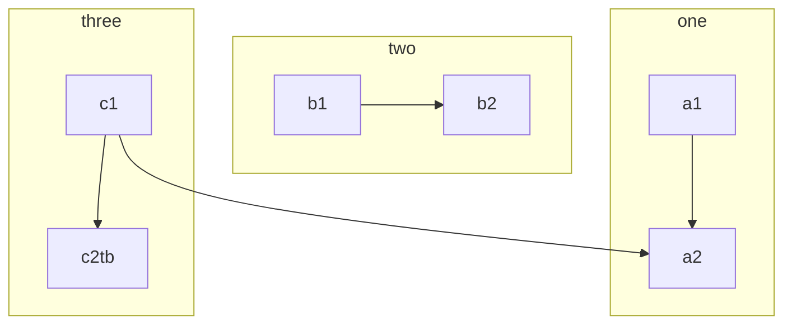
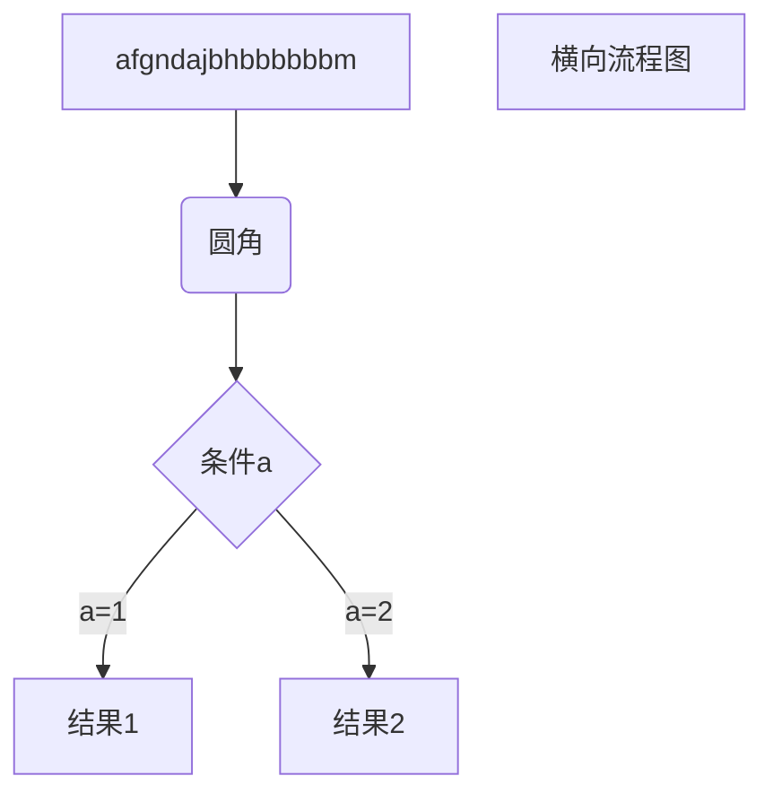

- abhiaubf
- 开封菊花去
- 发你和规格

# 的味道

# 发啊父亲给v通过v

|      |      |      |
| ---- | ---- | ---- |
|      |      |      |
|      |      |      |
|      |      |      |

`

```
uqerwhygyqwrygqwoasyfatsdo`asfFqDAd
```

** aygfutytu

1. 
2. sad
3. asdqw
4. dqwdqwh

```java
graph TD hbafib 
    ab 
   
```




```java
subgraph title
    graph definition
end
```

 graph TB

`

```mermaid
graph TD` 
   `A-->B;`
   `A-->C;`
   `B-->D;`
   `C-->D;
```

`

classDiagram Class01 <|-- AveryLongClass : Cool Class03 *-- Class04 Class05 o-- Class06 Class07 .. Class08 Class09 --> C2 : Where am i? Class09 --* C3 Class09 --|> Class07 Class07 : equals() Class07 : Object[] elementData Class01 : size() Class01 : int chimp Class01 : int gorilla Class08 <--> C2: Cool label

sequenceDiagram    participant 参与者 1    participant 参与者 2    ...    participant 简称 as 参与者

> graph TD    Start --> Stop

```java
grap
```

```java
graph LR
    start[开始]
``
```



``

```
==adgwe==
```

